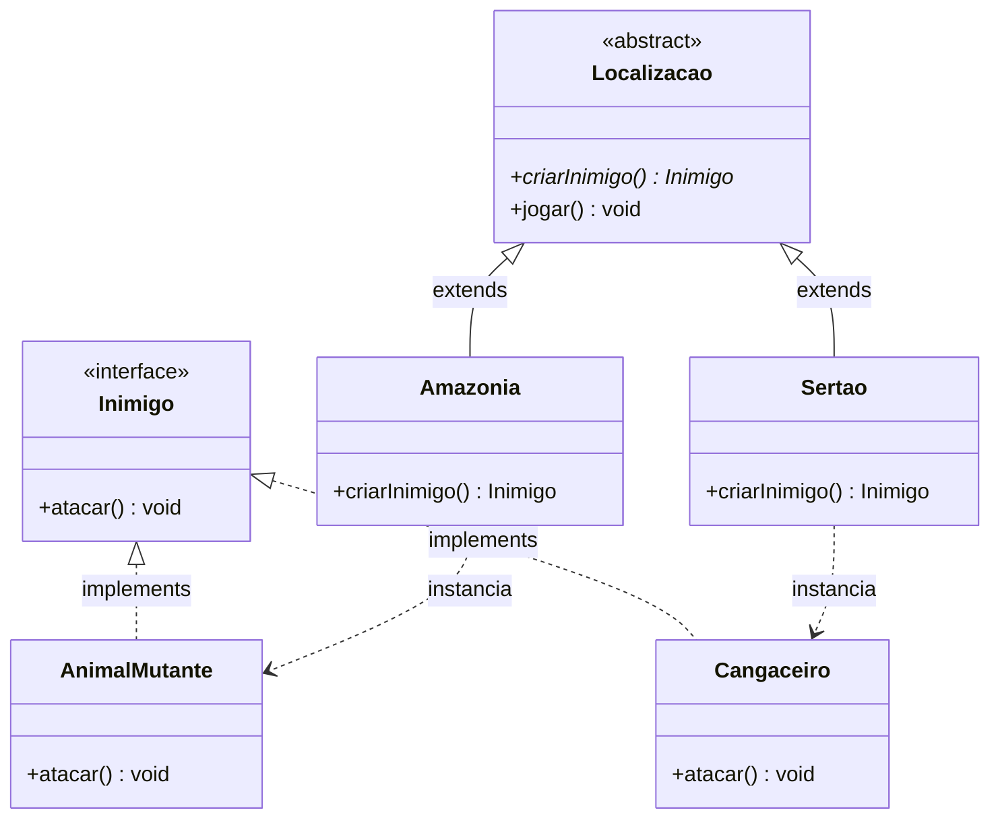

# Padroes_Jogo

## Antonio Mario Jesus Vidal Leite e Lucas Matheus Elias Silva Teixeira dos Santos

## Diagrama de Classes

# Resposta da I.A.

Tutorial Passo-a-Passo: Padrão Factory Method (Jogo)
Seguindo o mesmo modelo da atividade anterior, dividi a implementação em passos lógicos. Cada passo deve ser feito em um arquivo (ou grupo de arquivos) e ser acompanhado de um commit. Crie um novo pacote (pasta) no seu projeto chamado jogo para organizar esses arquivos.

Passo 1: Criar a Base do Padrão (Produto e Criador)
No padrão Factory Method, temos o "Produto" (o Inimigo) e o "Criador" (a Localização). O Criador declara o método fábrica (criarInimigo()), mas deixa as subclasses decidirem qual produto instanciar.

Crie a interface Inimigo.java.
Crie a classe abstrata Localizacao.java. Ela terá a lógica principal (jogar()) que não se importa com qual inimigo foi criado, apenas garante que ele ataque.
Ação: Faça o primeiro commit. Sugestão de Mensagem: "passo 1 (IA): Criar interface Inimigo e classe abstrata Localizacao (Factory)"
Passo 2: Implementar a Versão de Demonstração (Amazônia)
A primeira versão do seu jogo tinha apenas a Amazônia e Animais Mutantes. Vamos implementá-los de forma concreta.

Crie a classe AnimalMutante.java que implementa Inimigo.
Crie a classe Amazonia.java que herda de Localizacao e retorna um AnimalMutante.
Ação: Faça o segundo commit. Sugestão de Mensagem: "passo 2 (IA): Adicionar localização Amazônia e inimigo Animal Mutante"
Passo 3: Expandir o Jogo (Sertão)
Agora os jogadores pediram o Sertão. Veja como é fácil adicionar sem alterar a lógica principal (Localizacao)!

Crie a classe Cangaceiro.java.
Crie a classe Sertao.java.
Ação: Faça o terceiro commit. Sugestão de Mensagem: "passo 3 (IA): Expandir o jogo adicionando Sertão e Cangaceiro usando Factory Method"
Passo 4: Simulação e Teste
Vamos criar a classe Jogo.java (o cliente) para simular as fases.
Ação: Faça o quarto e último commit. Sugestão de Mensagem: "passo 4 (IA): Criar classe Jogo para simular as diferentes localizações" Dica: Se quiser, adicione nos comentários do código o que você faria se precisasse adicionar o Rio de Janeiro (como foi dito no futuro). Esse comentário pode ser um ótimo ajuste/incremento seu!
