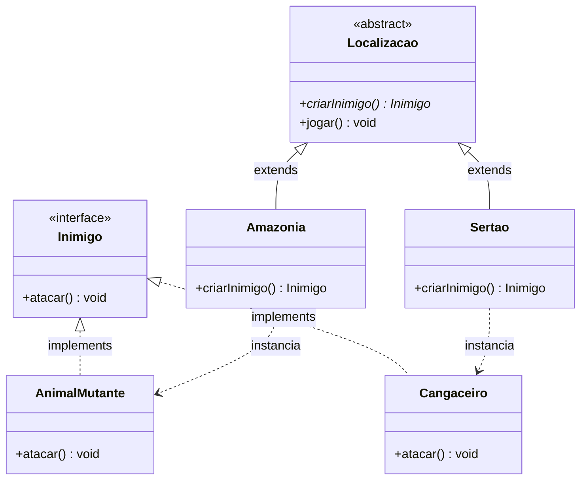

# Padroes_Jogo

## Diagrama de Classes

```mermaid
classDiagram
    class Inimigo {
        <<interface>>
        +atacar() void
    }
    class AnimalMutante {
        +atacar() void
    }
    class Cangaceiro {
        +atacar() void
    }
    Inimigo <|.. AnimalMutante : implements
    Inimigo <|.. Cangaceiro : implements

    class Localizacao {
        <<abstract>>
        +criarInimigo()* Inimigo
        +jogar() void
    }
    class Amazonia {
        +criarInimigo() Inimigo
    }
    class Sertao {
        +criarInimigo() Inimigo
    }
    Localizacao <|-- Amazonia : extends
    Localizacao <|-- Sertao : extends

    Amazonia ..> AnimalMutante : instancia
    Sertao ..> Cangaceiro : instancia
```

